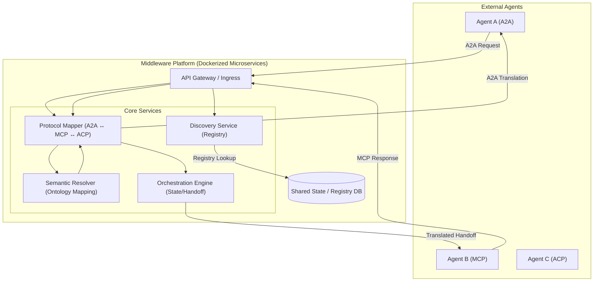

# System Architecture: Neutral Agent Translator Middleware

## 1. Vision
The Middleware acts as a universal bridge for agents, abstracting away protocol-specific complexities (A2A, MCP, ACP) and resolving semantic differences to enable seamless cross-vendor collaboration.

## 2. High-Level Architecture Diagram

## 3. Core Components

### A. Protocol Mapper
- **Responsibility**: Translates the structural "envelope" of messages.
- **Function**: Converts between A2A (JSON-RPC/DID-Comm), MCP (Multi-Agent coordination patterns), and ACP (Agent Communication Protocol) message formats.
- **Mapping Logic**: Maintains dynamic transformation rules as protocols evolve.

### B. Semantic Resolver
- **Responsibility**: Translates the "content" or "meaning" of the payload.
- **Function**: Uses a common ontology or LLM-driven mapping to ensure that "DeliveryDate" in Agent A's protocol means the same as "arrival_estimated" in Agent B's protocol.
- **Data Silo Resolution**: Maps disparate data schemas to a unified internal representation.

### C. Discovery Service
- **Responsibility**: Registry and lookup.
- **Function**: Allows agents to register their capabilities and supported protocols.
- **Dynamic Discovery**: Enables an A2A agent to find an ACP agent capable of solving a specific sub-task.

### D. Orchestration Engine
- **Responsibility**: Management of the transaction lifecycle.
- **Function**: Handles multi-turn handoffs, retries, and state persistence for complex tasks involving multiple agents.
- **Safety**: Integrates with governance layers (like Autonomy-Guard) to verify agent permissions.

## 4. Deployment & Scalability (Docker)
The architecture is designed as a set of containerized microservices:
- **Scalability**: Each service can scale independently based on throughput (e.g., more Protocol Mapper instances during high traffic).
- **Communication**: Services communicate via a high-performance message bus (like NATS or RabbitMQ) or gRPC for low latency.
- **Isolation**: Each protocol handler can be updated without affecting the core orchestration logic.

## 5. Data Flow Example
1. **Agent X (A2A)** sends a message to the **Ingress**.
2. **Discovery Service** identifies the target **Agent Y** supports **MCP**.
3. **Protocol Mapper** transforms the A2A envelope into an internal representation.
4. **Semantic Resolver** maps Agent X's request parameters to Agent Y's required schema.
5. **Orchestration Engine** routes the message to Agent Y and tracks the session.
6. **Agent Y (MCP)** receives a perfectly formatted request.
