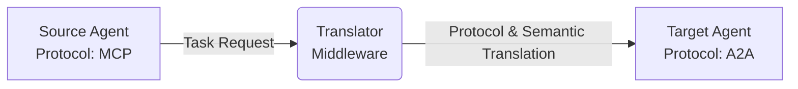
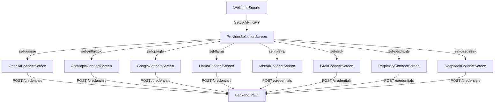
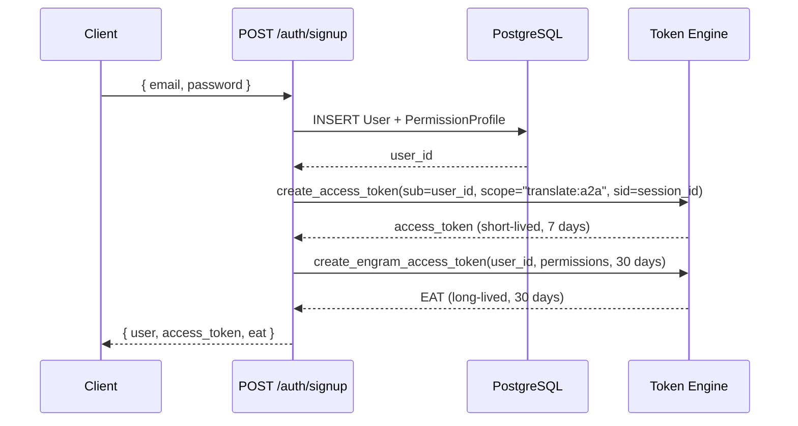
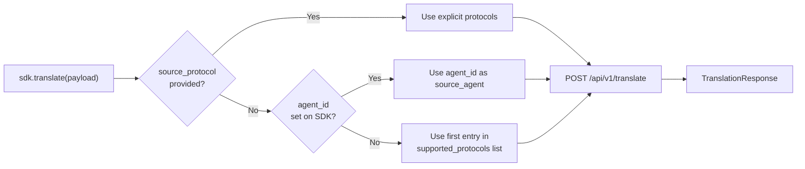
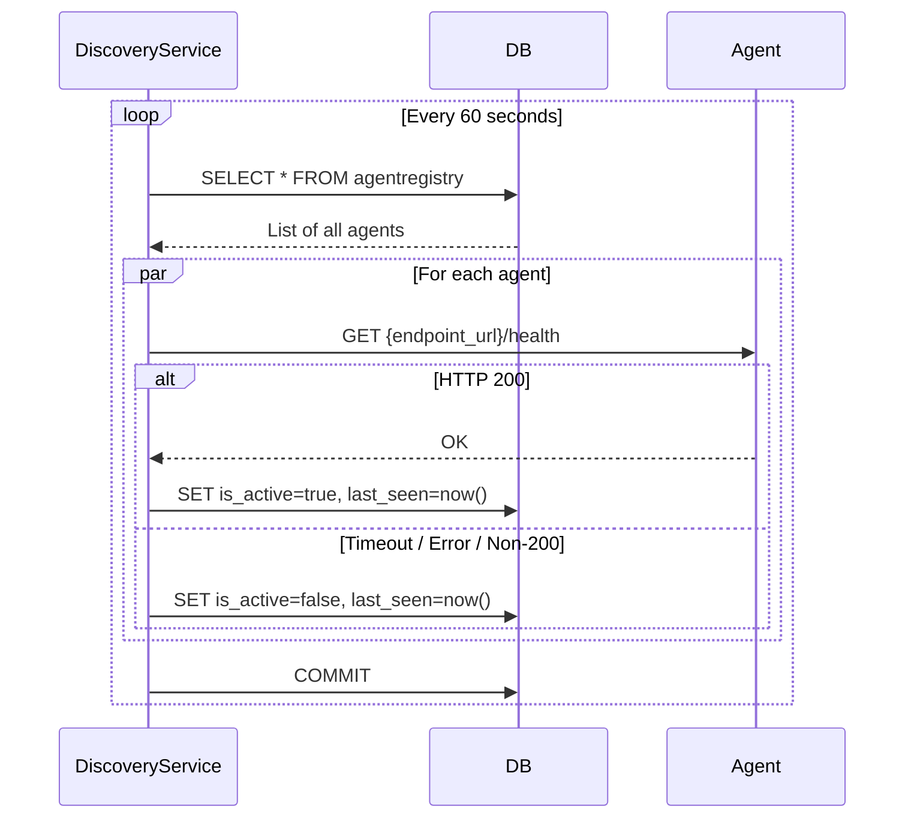
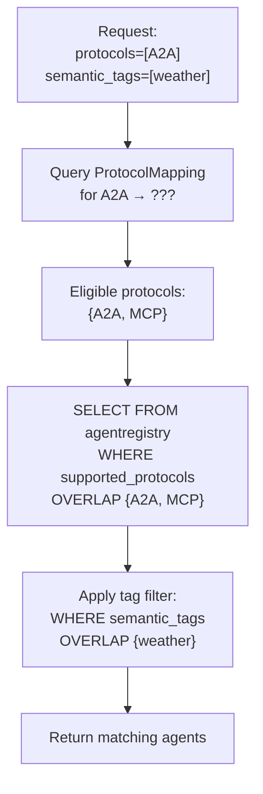
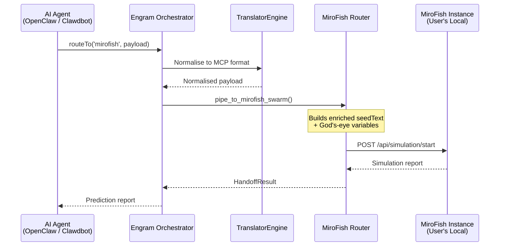
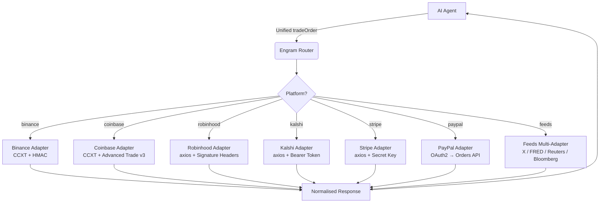

# Agent Translator Middleware

**The universal bridge for AI agents: translate protocols and schemas instantly to enable seamless cross-vendor collaboration.**

[](https://modelcontextprotocol.io)
[](#)
[](#)
[](https://opensource.org/licenses/MIT)

Agent Translator Middleware connects AI agents using different protocols (A2A, MCP, ACP). It handles protocol transformation and semantic mapping.

## Rationale

| Scenario | Without Translator | With Translator |
| :--- | :--- | :--- |
| **Agent Interop** | Isolated silos. | A2A - MCP - ACP communication. |
| **Data Mapping** | Manual schema mapping. | Direct semantic resolution via Owlready2. |
| **Task Handoff** | Schema mismatch failures. | Multi-hop routing with retry logic. |

AI agents today are often isolated because they speak different protocols (MCP, ACP, native A2A) and use differing data schemas. This middleware acts as a universal translator, allowing an MCP-based agent to seamlessly hand off a task to an ACP-based agent without either needing to change their underlying code.



---

## What's New

### 1. AI Provider Selection Hub (TUI)

The TUI includes a categorized **Model Directory** that lists major AI providers and their available model families. Selecting a provider opens a provider-specific API connection screen with pre-filled key format hints.

**Supported providers and their connection screens:**

| Provider | Models | Key Format | Connection Screen Class |
| :--- | :--- | :--- | :--- |
| **OpenAI** | GPT-4o, o1, o3-mini | `sk-proj-...` | `OpenAIConnectScreen` |
| **Anthropic** | Claude 3.5 Sonnet, Claude 3 Opus | `sk-ant-api03-...` | `AnthropicConnectScreen` |
| **Google DeepMind** | Gemini 1.5 Pro, 2.0 Flash | `AIzaSy...` | `GoogleConnectScreen` |
| **Meta / LLaMA** | LLaMA 3.1, 3.2 (self-hosted/API) | `llama-...` | `LlamaConnectScreen` |
| **Mistral AI** | Mistral Large, Mixtral 8x22B | Mistral API Key | `MistralConnectScreen` |
| **xAI (Grok)** | Grok-2, Grok-1.5 | `xoxb-...` | `GrokConnectScreen` |
| **Perplexity** | Research / Web Search | `pplx-...` | `PerplexityConnectScreen` |
| **DeepSeek** | DeepSeek-Coder | `sk-...` | `DeepseekConnectScreen` |

The directory is rendered via `ProviderSelectionScreen` in `tui/app.py`. Providers are grouped into categories (**AI Models** and **Software Tools**), with disabled header rows acting as section labels. Selecting a list item dismisses the screen and pushes the matching connection screen onto the stack.



Each connection screen inherits from `BaseServiceConnectScreen`, which handles the `POST /credentials` call to the backend and stores the credential locally via `VaultService`. The connection is provider-specific: it sends the `provider_name`, `credential_type` (either `api_key` or `oauth`), and the raw token as encrypted metadata.

---

### 2. Automated Engram Access Token (EAT) Generation

The `/signup` endpoint (`app/api/v1/auth.py`) automatically generates and returns a long-lived JWT called an **Engram Access Token (EAT)** upon successful registration. This eliminates the need to run `scripts/generate_token.py` manually after signing up.

**What happens on `POST /api/v1/auth/signup`:**



**Request:**

```bash
curl -X POST http://localhost:8000/api/v1/auth/signup \
  -H "Content-Type: application/json" \
  -d '{"email": "dev@example.com", "password": "s3cur3!", "user_metadata": {}}'
```

**Response (HTTP 201):**

```json
{
  "user": {
    "id": "a1b2c3d4-...",
    "email": "dev@example.com",
    "user_metadata": {},
    "is_active": true
  },
  "access_token": "eyJhbGci...",
  "token_type": "bearer",
  "eat": "eyJhbGci..."
}
```

**EAT structure (decoded):**

| Claim | Value | Description |
| :--- | :--- | :--- |
| `sub` | `"a1b2c3d4-..."` | User UUID |
| `type` | `"EAT"` | Token type identifier — distinguishes EATs from standard session tokens |
| `allowed_tools` | `["core_translator", "discovery"]` | Tool IDs this token grants access to |
| `scopes` | `{"core_translator": ["read", "execute"], "discovery": ["read"]}` | Per-tool permission map |
| `scope` | `"execute read"` | Flattened space-separated scope string for OAuth2 compatibility |
| `exp` | `1750000000` | Expiration (30 days from issue by default) |
| `iss` | `AUTH_ISSUER` | Issuer claim, validated on every request |
| `aud` | `AUTH_AUDIENCE` | Audience claim, validated on every request |
| `jti` | `"uuid-..."` | Unique token ID for revocation tracking via Redis |

The `access_token` is a short-lived session token (default 7 days, configurable via `ACCESS_TOKEN_EXPIRE_MINUTES`). The `eat` is the long-lived token (30 days) intended for agent-to-agent authentication. Both tokens can be revoked via `POST /api/v1/auth/tokens/revoke-eat` or `POST /api/v1/auth/logout`.

---

### 3. CLI Debugging & Monitoring Suite

A `debug` subcommand was added to the CLI (`app/cli.py`). Running `engram debug` (or `python app/cli.py debug`) starts the backend and launches the TUI directly into a `DebugScreen` instead of the standard `WelcomeScreen`.

**Launch commands:**

```bash
# Via the CLI entry point
python app/cli.py debug

# Via the batch script (Windows)
.\engram.bat debug

# With custom host/port
python app/cli.py debug --host 0.0.0.0 --port 9000
```

**DebugScreen capabilities:**

| Panel | Widget | What it shows |
| :--- | :--- | :--- |
| **Task List** | `DataTable` | All queued/running/completed tasks with IDs, status, and timestamps |
| **Protocol Trace** | `TabbedContent` with source/target panes | Side-by-side view of the original message and its translated output (e.g., A2A input → MCP output) |
| **Event Log** | `RichLog` | Live stream of backend events — translation attempts, version delta upgrades, mapping failures, and task state transitions |

The event log is powered by `tui_bridge.py`, which defines a `structlog` processor called `tui_logger_processor`. This processor intercepts translation-related log events and pushes plain-English messages to an async queue (`tui_event_queue`) that the TUI polls. The following backend events are captured and displayed:

```
Event: "Translating message"    → "🔄 Translating message from MCP to A2A..."
Event: "Applied version delta"  → "✨ MCP message upgraded: 1.0 ➡️ 2.0"
Event: "Translation failed"     → "❌ Translation failed: <error>"
Event: "No translation rule"    → "⚠️ Missing map: No path found for X to Y"
Event: "Version mismatch"       → "⚖️ Version mismatch in MCP: Found 1.0, expected 2.0"
```

The debug CSS layout (`#debug-container`, `#debug-list-panel`, `#debug-detail-panel`, `#debug-tabs`) occupies 95% of the terminal width and height with a green heavy border to visually distinguish it from the standard shell.

---

### 4. Integrated SDK Translation Layer

The `engram_sdk` Python package includes a built-in `TranslationClient` (`engram_sdk/translation.py`) that wraps the middleware's translation API. When you call `sdk.translate()`, the SDK automatically handles protocol detection, request formatting, and response parsing. You do not need to manually construct protocol-specific payloads or define custom mappings.

**How the SDK auto-resolves protocols:**



**Example — explicit protocol pair:**

```python
from engram_sdk import EngramSDK

sdk = EngramSDK(
    base_url="http://localhost:8000/api/v1",
    eat="<YOUR_EAT>",
)

result = sdk.translate(
    {"intent": "schedule_meeting", "participants": ["alice", "bob"]},
    source_protocol="a2a",
    target_protocol="mcp",
)

print(result.status)   # "success"
print(result.payload)  # Translated MCP-format payload
print(result.mapping_suggestions)  # ML-suggested field mappings (if any)
```

**Example — agent-to-agent (protocol auto-resolved from registry):**

```python
result = sdk.translate(
    {"intent": "schedule_meeting", "participants": ["alice", "bob"]},
    source_agent="agent-a",
    target_agent="agent-b",
)
```

When `source_agent` and `target_agent` are provided, the backend looks up each agent's `supported_protocols` from the `AgentRegistry` table and determines the translation path automatically via the `ProtocolGraph` (Dijkstra shortest path).

**Response structure (`TranslationResponse`):**

```python
@dataclass
class TranslationResponse:
    status: str                                  # "success" or "error"
    message: str                                 # Human-readable result
    payload: Dict[str, Any]                      # The translated payload
    mapping_suggestions: List[MappingSuggestion]  # ML fallback suggestions
```

Each `MappingSuggestion` contains a `source_field`, `suggestion` (predicted target field name), `confidence` (float 0–1), and `applied` (bool indicating if it was auto-applied because confidence ≥ 0.85).

---

### 5. Production-Grade Database Migrations (Alembic)

The backend uses **Alembic** for version-controlled database schema migrations, replacing the previous `SQLModel.metadata.create_all` approach.

**Directory structure:**

```
alembic/
├── env.py           # Async migration runner (uses async_engine_from_config)
├── script.py.mako   # Migration template
└── versions/        # Generated migration scripts (one per schema change)
alembic.ini          # Alembic configuration (reads DATABASE_URL from settings)
```

**How it works:**

1. `alembic/env.py` imports all SQLModel models from `app/db/models.py` to register them with `SQLModel.metadata`.
2. The `target_metadata` is set to `SQLModel.metadata`, so Alembic can auto-detect schema changes.
3. Migrations run in **async mode** using `async_engine_from_config` with the `asyncpg` driver — the same connection pool used by the application.
4. The `DATABASE_URL` is injected from `app.core.config.settings`, ensuring migrations always target the same database as the running application.

**Common commands:**

```bash
# Generate a new migration after modifying models
alembic revision --autogenerate -m "add_new_column"

# Apply all pending migrations
alembic upgrade head

# Roll back one migration
alembic downgrade -1

# Show current migration state
alembic current

# Show migration history
alembic history
```

**Models tracked by Alembic** (defined in `app/db/models.py`):

| Model | Table | Purpose |
| :--- | :--- | :--- |
| `ProtocolMapping` | `protocolmapping` | Source→target protocol translation rules |
| `ProtocolVersionDelta` | `protocolversiondelta` | Version upgrade operations (rename, drop, set) |
| `AgentRegistry` | `agentregistry` | Registered agents with protocols, tags, health status |
| `SemanticOntology` | `semanticontology` | OWL ontology entries for semantic resolution |
| `Task` | `task` | Queued translation tasks (JSONB payload, status, lease) |
| `AgentMessage` | `agentmessage` | Translated messages pending agent pickup |
| `MappingFailureLog` | `mappingfailurelog` | Failed field mappings for ML retraining |
| `User` | `user` | User accounts with hashed passwords |
| `PermissionProfile` | `permissionprofile` | Per-user tool permission maps |
| `ProviderCredential` | `providercredential` | Encrypted API keys for connected providers |
| `Workflow` | `workflow` | Multi-step workflow definitions |
| `WorkflowSchedule` | `workflowschedule` | Cron/interval schedules for workflows |

---

### 6. Containerized Infrastructure (Docker Compose)

The `docker-compose.yml` orchestrates the full production stack with a single command:

```bash
docker compose up --build
```

**Services defined in `docker-compose.yml`:**

| Service | Image / Build | Port | Role |
| :--- | :--- | :--- | :--- |
| `app` | `Dockerfile` (FastAPI + uvicorn) | `8000` | Runs the FastAPI backend, TranslatorEngine, TaskWorker, and DiscoveryService |
| `frontend` | `playground/Dockerfile` | `3000` | Vite dev server for the interactive translation playground |
| `db` | `postgres:16-alpine` | `5432` | PostgreSQL persistent storage for all models |
| `redis` | `redis:7.2-alpine` | `6379` | Semantic mapping cache (key pattern `semantic:equivalent:<protocol>:<concept>`) with configurable TTL (default 600s) |
| `prometheus` | `prom/prometheus:v2.52.0` | `9090` | Scrapes `/metrics` from the FastAPI app for translation counters and latency histograms |
| `grafana` | `grafana/grafana:10.4.2` | `3001` | Pre-provisioned dashboards from `monitoring/grafana/` for translation throughput and error rate visualization |

```mermaid
flowchart TB
    subgraph Docker Compose Stack
        APP["app :8000<br/>FastAPI + TaskWorker<br/>+ DiscoveryService"]
        FE["frontend :3000<br/>Playground (Vite)"]
        DB["db :5432<br/>PostgreSQL 16"]
        REDIS["redis :6379<br/>Redis 7.2"]
        PROM["prometheus :9090<br/>Metrics Scraper"]
        GRAF["grafana :3001<br/>Dashboards"]
    end

    APP --> DB
    APP --> REDIS
    PROM -->|"scrape /metrics"| APP
    GRAF --> PROM
    FE --> APP

    style APP fill:#132019,stroke:#2bdc8d
    style DB fill:#1a1a2e,stroke:#4285F4
    style REDIS fill:#2d1a1a,stroke:#FF4E00
    style PROM fill:#1a1a1a,stroke:#e6e1d7
    style GRAF fill:#1a1a1a,stroke:#e0b15b
    style FE fill:#1a1a1a,stroke:#FF9966
```



All services are connected via the `agent_network` bridge network. PostgreSQL data persists across restarts via the `postgres_data` named volume.

**Staging environment** (adds WireMock for mocking external agent endpoints):

```bash
docker compose -f docker-compose.staging.yml up --build -d
```

**Environment variables** consumed from `.env`:

| Variable | Default | Used By |
| :--- | :--- | :--- |
| `POSTGRES_USER` | `admin` | `db` service + `app` connection string |
| `POSTGRES_PASSWORD` | `password` | `db` service + `app` connection string |
| `POSTGRES_DB` | `translator_db` | `db` service + `app` connection string |
| `GRAFANA_ADMIN_USER` | `admin` | Grafana login |
| `GRAFANA_ADMIN_PASSWORD` | `admin` | Grafana login |
| `GRAFANA_SMTP_*` | — | Email alerting from Grafana |

---

### 7. Visual Branding & Startup Screen

The TUI displays a clean, standard-font **ENGRAM** typographic logo on startup via the `WelcomeScreen` class. The logo uses an ASCII block font rendered in the `#FF9966` (orange) color.

```
  _____   _   _    ____   ____       _      __  __ 
 | ____| | \ | |  / ___| |  _ \     / \    |  \/  |
 |  _|   |  \| | | |  _  | |_) |   / _ \   | |\/| |
 | |___  | |\  | | |_| | |  _ <   / ___ \  | |  | |
 |_____| |_| \_|  \____| |_| \_\ /_/   \_\ |_|  |_|
```

The `WelcomeScreen` provides two entry paths:

- **"Start Bridging"** — Pops the welcome screen and drops the user into the main shell.
- **"Setup API Keys"** — Pushes `ProviderSelectionScreen` onto the stack to configure AI provider credentials before entering the shell.

The main shell header reuses the same logo with the tagline `Universal Protocol Bridge` rendered in dim text below it.

---

### 8. Agent Heartbeat (Periodic Discovery Service)

The `DiscoveryService` (`app/services/discovery.py`) runs a background loop that pings every registered agent's `/health` endpoint on a configurable interval (default: **60 seconds**).

**How the heartbeat loop works:**



**Implementation details:**

| Parameter | Value | Description |
| :--- | :--- | :--- |
| `ping_interval` | `60` seconds (constructor arg) | Time between full discovery cycles |
| `ping_timeout` | `5` seconds (constructor arg) | Per-agent HTTP timeout via `aiohttp.ClientTimeout` |
| `DEFAULT_HEALTH_PATH` | `/health` | Appended to the agent's `endpoint_url` |
| Concurrency | `asyncio.gather(*tasks)` | All agents are pinged concurrently within each cycle |

When an agent's status changes (online → offline or vice versa), the service logs the transition:

```
DiscoveryService: Agent status changed | agent_id=agent-a | status=OFFLINE
```

The service is started automatically on application boot via `start_periodic_discovery()` and stopped gracefully with `stop_periodic_discovery()` on shutdown (cancels the background `asyncio.Task`).

**Why this matters:** Inactive agents are excluded from the collaborator search results. The `TaskWorker` will not route tasks to agents marked `is_active=false`, preventing message delivery to dead endpoints.

---

### 9. Agent Compatibility Scoring & Matchmaking

The `GET /api/v1/discovery/collaborators` endpoint returns a ranked list of agents sorted by a **compatibility score**. This score quantifies how well a candidate agent can interoperate with the requesting agent.

**The compatibility formula:**

$$Score = \frac{\text{Shared Protocols} + \text{Mappable Protocols}}{\text{Total Candidate Protocols}}$$

| Term | Definition |
| :--- | :--- |
| **Shared Protocols** | Protocols that both the requesting agent and the candidate agent support natively (e.g., both speak `MCP`) |
| **Mappable Protocols** | Protocols the candidate supports that the requesting agent does not, but which the `TranslatorEngine` can translate to from one of the requester's protocols (determined by `ProtocolMapping` rows in the database) |
| **Total Candidate Protocols** | The total number of protocols the candidate agent supports |

**Example:**

Your agent speaks `A2A`. A candidate agent speaks `A2A`, `MCP`, and `ACP`. The database has a `ProtocolMapping` row for `A2A → MCP`, but not `A2A → ACP`.

```
shared     = {A2A}         → count = 1
mappable   = {MCP}         → count = 1  (A2A→MCP exists)
total      = {A2A,MCP,ACP} → count = 3

score = (1 + 1) / 3 = 0.6667
```

**API usage:**

```bash
# Find agents compatible with an A2A-speaking agent, minimum score 0.5
curl "http://localhost:8000/api/v1/discovery/collaborators?protocols=A2A&min_score=0.5" \
  -H "Authorization: Bearer <TOKEN>"
```

**Response:**

```json
[
  {
    "agent_id": "agent-scheduler",
    "endpoint_url": "http://agent-scheduler:8080",
    "supported_protocols": ["a2a", "mcp"],
    "is_active": true,
    "compatibility_score": 1.0,
    "shared_protocols": ["A2A"],
    "mappable_protocols": ["MCP"]
  },
  {
    "agent_id": "agent-weather",
    "endpoint_url": "http://agent-weather:8081",
    "supported_protocols": ["mcp", "acp"],
    "is_active": true,
    "compatibility_score": 0.5,
    "shared_protocols": [],
    "mappable_protocols": ["MCP"]
  }
]
```

**Implementation:** `DiscoveryService.find_collaborators()` in `app/services/discovery.py`. Only agents with `is_active=true` are considered. Results are sorted by `compatibility_score` descending. The `min_score` query parameter (default `0.7`, range `0.0–1.0`) filters out low-compatibility candidates.

---

### 10. Semantic Tag Filtering

Agents can register with **semantic tags** — a list of capability keywords (e.g., `["weather", "scheduling", "search"]`). The discovery endpoints use these tags to filter agents by functional capability, not just protocol compatibility.

**Registering an agent with semantic tags:**

```bash
curl -X POST http://localhost:8000/api/v1/register \
  -H "Content-Type: application/json" \
  -d '{
    "agent_id": "agent-weather",
    "endpoint_url": "http://agent-weather:8081",
    "supported_protocols": ["mcp"],
    "semantic_tags": ["weather", "forecast", "geo"],
    "is_active": true
  }'
```

**Discovering agents filtered by tags:**

```bash
curl -X POST http://localhost:8000/api/v1/discovery/ \
  -H "Content-Type: application/json" \
  -H "Authorization: Bearer <TOKEN>" \
  -d '{
    "protocols": ["a2a"],
    "semantic_tags": ["weather"]
  }'
```

This `POST /api/v1/discovery/` endpoint applies **two filters**:

1. **Protocol eligibility** — Returns agents whose `supported_protocols` overlap with the requested protocols or protocols reachable via `ProtocolMapping` translations.
2. **Semantic tag overlap** — Filters the eligible agents to only those whose `semantic_tags` array has at least one element in common with the requested tags. This uses PostgreSQL's `ARRAY && ARRAY` (overlap) operator via SQLAlchemy's `.overlap()`.

**How the two-stage filter works:**



**SDK usage:**

```python
from engram_sdk import EngramSDK

sdk = EngramSDK(
    base_url="http://localhost:8000/api/v1",
    eat="<YOUR_EAT>",
    agent_id="my-agent",
    endpoint_url="http://localhost:9000",
    supported_protocols=["a2a"],
    semantic_tags=["scheduling", "calendar"],
)

# Register this agent with its tags
sdk.register_agent()
```

Tags are stored as a PostgreSQL `ARRAY` column on the `AgentRegistry` model. There is no predefined tag vocabulary — agents define their own tags during registration, and discovery consumers query against them freely.

---

## Core Features

*   **Protocol Translation:** Converts messages and payloads between A2A, MCP, and ACP formats.
*   **Semantic Mapping:** Uses OWL ontologies, JSON Schema, and PyDatalog to map data fields between different agent schemas (e.g., mapping `user_info.name` to `profile.fullname`).
*   **MiroFish Swarm Bridge:** Pipe inter-agent messages and live data directly into a MiroFish swarm simulation and receive compiled prediction reports back.
*   **Trading Semantic Templates:** Standard adapters for Binance, Coinbase, Robinhood, Kalshi, Stripe, PayPal, and live data feeds (X, FRED, Reuters, Bloomberg).
*   **Agent Registry & Discovery:** Registration and lookup of agent protocols and semantic capabilities based on computed compatibility scores.
*   **Async Orchestration:** Task queues and worker processes for multi-turn agent handoffs, message leases, and retries.
*   **Fallback Mapping:** Machine learning model for field mapping suggestions when default semantic rules are insufficient.

---

## Developer Toolkit (SDK + Examples)

If you want to integrate your own tools quickly, start here:

* `docs/DEVELOPER_TOOLKIT.md`
* `examples/engram_toolkit/README.md`

These cover SDK installation, tool registration, agent connection, and task execution.

---

## MiroFish Swarm Bridge

The **MiroFish Swarm Bridge** connects Engram's protocol translation pipeline to a [MiroFish](https://github.com/666ghj/MiroFish) simulation. Agents can pipe messages and external context into a swarm simulation and receive predictions or reports back.

This integration enables predictive trading flows where live data context is used to run a swarm simulation before trade execution.

### How It Works (Under the Hood)



1. The caller specifies `target_protocol="mirofish"` (case-insensitive).
2. The Orchestrator detects the MiroFish target and short-circuits the normal protocol graph.
3. The payload is normalised through Engram's `TranslatorEngine` (A2A/ACP → MCP), preserving **semantic fidelity** regardless of the originating protocol.
4. The router automatically fetches live context — real-time prices (via CCXT), sentiment scores (X / Reuters), and recent news headlines — and injects them as "God's-eye variables" alongside the seed text.
5. The enriched payload is `POST`ed to the user's MiroFish `/api/simulation/start` endpoint.
6. The compiled simulation report (predictions, agent consensus, recommendations) is returned as the `HandoffResult.translated_message`.

### Prerequisites

> **Every user must run their own MiroFish instance.** The bridge connects to *your* local (or self-hosted) MiroFish installation. No shared API keys or cloud dependencies.

1. **Clone and set up MiroFish** (already included as a submodule in this repository under `MiroFish/`):
   ```bash
   cd MiroFish
   cp .env.example .env
   ```
2. **Add your personal LLM API key** to the MiroFish `.env`:
   ```env
   LLM_API_KEY=your_api_key_here
   LLM_BASE_URL=https://dashscope.aliyuncs.com/compatible-mode/v1
   LLM_MODEL_NAME=qwen-plus
   ZEP_API_KEY=your_zep_api_key_here
   ```
3. **Start MiroFish**:
   ```bash
   npm run dev          # Source code
   # OR
   docker compose up -d # Docker
   ```
4. Verify MiroFish is running at `http://localhost:5001`.

### Configuration

Add these optional environment variables to your Engram `.env` file to customise bridge defaults:

| Variable | Default | Description |
| :--- | :--- | :--- |
| `MIROFISH_BASE_URL` | `http://localhost:5001` | Base URL of your MiroFish service. |
| `MIROFISH_DEFAULT_NUM_AGENTS` | `1000` | Default number of agents to spawn per swarm simulation. |
| `MIROFISH_DEFAULT_SWARM_ID` | `default` | Default swarm identifier for parallel simulations. |

### Usage Examples

#### TypeScript — One-Line SDK (OpenClaw / Clawdbot)

The fastest way to use the bridge. One import, one call, full swarm simulation:

```ts
import { engram } from './mirofish-bridge';

// Send a message and receive the simulation report
const report = await engram.routeTo('mirofish', 'Analyse upcoming ETH merge impact', {
  swarmId: 'prediction-market-1',
  mirofishBaseUrl: 'http://localhost:5001',
  numAgents: 1000,
});

console.log(report); // Full simulation report with predictions
```

You can also use the SDK config loader for a persistent, reusable connection:

```ts
import { loadEngramConfig } from './engram-sdk';

const engram = loadEngramConfig({
  enableMiroFishBridge: true,
  mirofishBaseUrl: 'http://localhost:5001',
  swarmId: 'crypto-swarm',
  defaultAgentCount: 500,
});

// Now use it anywhere in your agent flow
const report = await engram.routeTo('mirofish', 'BTC 7-day price forecast');
```

#### TypeScript — Low-Level Bridge API

For more granular control (seed injection, mid-simulation God's-eye injection):

```ts
import { MiroFishBridge } from './mirofish-bridge';

const bridge = MiroFishBridge('http://localhost:5001');

// 1. Pipe a seed text into the swarm
await bridge.pipe('agent-1', 'A2A', {
  seed_text: 'Analyse impact of new SEC regulations on DeFi',
  num_agents: 2000,
}, 'regulation-swarm');

// 2. Inject live events mid-simulation (God's-eye injection)
await bridge.godsEye('regulation-swarm', [
  { type: 'price_update', symbol: 'ETH/USD', price: '3800.50' },
  { type: 'news_flash', headline: 'SEC announces new DeFi framework' },
]);
```

#### Python — Orchestrator Routing (Backend)

On the server side, use the Orchestrator directly. This is the path used by the TaskWorker for async queue processing:

```python
from app.messaging.orchestrator import Orchestrator

orchestrator = Orchestrator()

# Async path (from a FastAPI route or async handler):
result = await orchestrator.handoff_async(
    source_message={
        "intent": "predict",
        "content": "BTC 7-day forecast",
        "metadata": {
            "swarmId": "crypto-swarm",
            "mirofishBaseUrl": "http://localhost:5001",
            "numAgents": 500,
            "externalData": {
                "prices": [{"symbol": "BTC/USD", "price": "64200"}],
                "sentiment": {"source": "X", "score": 0.72, "label": "Bullish"}
            }
        }
    },
    source_protocol="A2A",
    target_protocol="mirofish",
)

print(result.translated_message)  # Simulation report
```

#### cURL — REST API

```bash
curl -X POST http://localhost:8000/api/v1/translate \
  -H "Authorization: Bearer <JWT_TOKEN>" \
  -H "Content-Type: application/json" \
  -d "{\"source_protocol\":\"a2a\",\"target_protocol\":\"mirofish\",\"payload\":{\"intent\":\"predict\",\"content\":\"Analyse ETH merge impact\",\"metadata\":{\"swarmId\":\"eth-swarm\",\"numAgents\":1000}}}"
```

### Testing the Bridge

The integration test suite includes a full end-to-end test that **does not require a live MiroFish instance or LLM key** — it uses a built-in mock server:

```bash
# Standalone (no pytest needed)
$env:PYTHONPATH="."
python tests/integration/test_mirofish_e2e.py

# Via pytest
pytest tests/integration/test_mirofish_e2e.py -v
```

The test validates: mock MiroFish server startup → agent creation → enriched trading signal construction → Orchestrator routing → semantic fidelity (prices, sentiment, headlines arrive without drift) → simulation report return → trade execution simulation → cycle timing (< 60 seconds).

### File Map

| File | Purpose |
| :--- | :--- |
| `app/services/mirofish_router.py` | Python-side router — normalises payloads + HTTP POST to MiroFish |
| `app/messaging/orchestrator.py` | Orchestrator conditional: `if target == "MIROFISH"` |
| `app/core/config.py` | `MIROFISH_BASE_URL`, `MIROFISH_DEFAULT_NUM_AGENTS`, `MIROFISH_DEFAULT_SWARM_ID` |
| `playground/src/mirofish-bridge.ts` | TypeScript `engram.routeTo('mirofish', ...)` one-liner + low-level bridge |
| `playground/src/engram-sdk.ts` | SDK config loader + adapter registry |
| `tests/integration/test_mirofish_e2e.py` | Full E2E test — predict + execute hybrid loop |

---

## Multi-Platform Trading Semantic Templates

### What Is It?

**Trading Semantic Templates** provide standardized adapters for exchanges, prediction markets, payment systems, and data feeds. This module allows agents to use a single schema across platforms without custom transformation code.

Engram translates the unified payload into the specific API format for the target platform (e.g., Binance, Kalshi, Stripe).

### Supported Platforms

| Category | Platform | Adapter | API Method |
| :--- | :--- | :--- | :--- |
| **Crypto Exchanges** | Binance | `binance-adapter.js` | CCXT (HMAC signing, rate limiting) |
| | Coinbase | `coinbase-adapter.js` | CCXT (Advanced Trade v3) |
| | Robinhood Crypto | `robinhood-adapter.js` | Direct REST (v2 fee-tier endpoint) |
| **Prediction Markets** | Kalshi | `kalshi-adapter.js` | Direct REST (trade-api/v2) |
| **Payment Rails** | Stripe | `stripe-adapter.js` | Direct REST (Payment Intents API) |
| | PayPal | `paypal-adapter.js` | OAuth2 → Orders API |
| **Live Data Feeds** | X (Twitter) | `feeds-adapter.js` | Tweets Search (recent) |
| | FRED | `feeds-adapter.js` | Series Observations API |
| | Reuters | `feeds-adapter.js` | Placeholder (enterprise license) |
| | Bloomberg | `feeds-adapter.js` | Placeholder (Terminal/B-PIPE) |

### How It Works



1. **Unified Schema** — Your agent builds a single structured payload (`tradeOrder`, `balanceQuery`, `paymentIntent`, or `feedRequest`) using the unified schema. This schema covers trade orders (limit, market, stop), balance queries, payment intents, and feed requests.
2. **Semantic Normalisation** — Engram maps the unified schema fields to each platform's native API format automatically.
3. **API Authentication** — Each adapter uses the API keys you provide in your configuration (per-platform, stored securely per instance).
4. **Response Unification** — Heterogeneous platform responses are normalised back into a consistent structure.

### Setup

1. **Install the trading templates module** (if not already bundled):
   ```bash
   cd trading-templates
   npm install
   ```

2. **Configure your platform API keys** in your `.env`:
   ```env
   # Crypto Exchanges
   BINANCE_API_KEY=your_binance_api_key
   BINANCE_SECRET=your_binance_secret
   COINBASE_API_KEY=your_coinbase_api_key
   COINBASE_SECRET=your_coinbase_secret
   ROBINHOOD_API_KEY=your_robinhood_api_key
   ROBINHOOD_ACCESS_TOKEN=your_robinhood_access_token

   # Prediction Markets
   KALSHI_TOKEN=your_kalshi_token

   # Payment Rails
   STRIPE_SECRET_KEY=your_stripe_secret_key
   PAYPAL_CLIENT_ID=your_paypal_client_id
   PAYPAL_CLIENT_SECRET=your_paypal_client_secret

   # Live Data Feeds
   X_BEARER_TOKEN=your_x_bearer_token
   FRED_API_KEY=your_fred_api_key
   REUTERS_APP_KEY=your_reuters_partner_key      # Enterprise only
   BLOOMBERG_SERVICE_ID=your_bloomberg_id         # Terminal/B-PIPE only
   ```

3. **Enable platforms** via the SDK (only configure the platforms you need):
   ```ts
   import { engram } from './mirofish-bridge';

   engram.enableTradingTemplate('binance', {
     BINANCE_API_KEY: process.env.BINANCE_API_KEY,
     BINANCE_SECRET: process.env.BINANCE_SECRET,
   });

   engram.enableTradingTemplate('stripe', {
     STRIPE_SECRET_KEY: process.env.STRIPE_SECRET_KEY,
   });
   ```

### Usage Examples

#### Example 1: Place a Trade on Binance

```ts
const result = await engram.routeTo('binance', {
  tradeOrder: {
    symbol: 'BTC/USDT',
    action: 'limit',
    quantity: 0.01,
    price: 64000,
  }
});

console.log(result);
// {
//   status: 'success',
//   platform: 'binance',
//   result: { orderId: '...', status: 'NEW', ... },
//   timestamp: '2026-03-21T...'
// }
```

#### Example 2: Check Balance on Coinbase

```ts
const balance = await engram.routeTo('coinbase', {
  tradeOrder: {
    action: 'balance',
  }
}, {
  COINBASE_API_KEY: process.env.COINBASE_API_KEY,
  COINBASE_SECRET: process.env.COINBASE_SECRET,
});
```

#### Example 3: Place a Prediction Market Bet on Kalshi

```ts
const prediction = await engram.routeTo('kalshi', {
  tradeOrder: {
    symbol: 'PRES-2028-DEM',
    action: 'buy',
    quantity: 50,
  }
});
```

#### Example 4: Create a Stripe Payment Intent

```ts
const payment = await engram.routeTo('stripe', {
  tradeOrder: {
    amount: 49.99,
    currency: 'usd',
    customerId: 'cus_abc123',
  }
});
```

#### Example 5: Process a PayPal Order

```ts
const order = await engram.routeTo('paypal', {
  tradeOrder: {
    amount: 29.99,
    currency: 'USD',
    customerId: 'buyer_ref_001',
  }
});
```

#### Example 6: Fetch Live Data Feeds

Pull real-time sentiment, economic indicators, or news to enrich your trading decisions:

```ts
// Fetch recent tweets about Bitcoin from X
const xFeed = await engram.routeTo('feeds', {
  source: 'x',
  query: 'Bitcoin price prediction',
});

// Fetch GDP data from FRED
const fredFeed = await engram.routeTo('feeds', {
  source: 'fred',
  query: 'GDP',
});
```

#### Example 7: Combined Trade + Feed Enrichment (Predict-Execute Loop)

The most powerful pattern — automatically enrich a trade order with live data before execution:

```ts
const enrichedTrade = await engram.routeTo('binance', {
  tradeOrder: {
    symbol: 'ETH/USDT',
    action: 'market',
    quantity: 0.5,
  },
  feedRequest: {
    source: 'x',
    query: 'Ethereum sentiment',
  }
});

console.log(enrichedTrade);
// {
//   status: 'success',
//   platform: 'binance',
//   result: { ... },
//   enrichedContext: {
//     source: 'x',
//     data: [{ id: '...', text: '...' }, ...],
//     metadata: { newest_id: '...', result_count: 10 }
//   },
//   timestamp: '2026-03-21T...'
// }
```

#### Example 8: Multi-Platform Routing (Same Payload, Multiple Exchanges)

Route the identical unified payload to multiple platforms sequentially:

```ts
const order = {
  tradeOrder: {
    symbol: 'BTC/USDT',
    action: 'limit',
    quantity: 0.005,
    price: 63500,
  }
};

const binanceResult = await engram.routeTo('binance', order);
const coinbaseResult = await engram.routeTo('coinbase', order);
// Same structured payload, no changes needed between platforms
```

### Unified Schema Reference

The unified schema covers four payload types. Your agent constructs one of these objects and the adapters handle the rest:

| Payload Type | Key Fields | Used By |
| :--- | :--- | :--- |
| **Trade Order** | `symbol`, `action` (limit/market/stop/buy/sell/balance), `quantity`, `price` | Binance, Coinbase, Robinhood, Kalshi |
| **Payment Intent** | `amount`, `currency`, `customerId` | Stripe, PayPal |
| **Feed Request** | `source` (x/fred/reuters/bloomberg), `query` | Feeds adapter |
| **Balance Query** | `action: 'balance'` | Binance, Coinbase |

### File Map

| File | Purpose |
| :--- | :--- |
| `trading-templates/index.js` | Module entry point — exports all adapters |
| `trading-templates/adapters/binance-adapter.js` | Binance exchange adapter (CCXT) |
| `trading-templates/adapters/coinbase-adapter.js` | Coinbase Advanced Trade adapter (CCXT) |
| `trading-templates/adapters/robinhood-adapter.js` | Robinhood Crypto adapter (direct REST) |
| `trading-templates/adapters/kalshi-adapter.js` | Kalshi prediction market adapter (REST) |
| `trading-templates/adapters/stripe-adapter.js` | Stripe Payment Intents adapter (REST) |
| `trading-templates/adapters/paypal-adapter.js` | PayPal Orders adapter (OAuth2 + REST) |
| `trading-templates/adapters/feeds-adapter.js` | Multi-source feeds adapter (X, FRED, Reuters, Bloomberg) |
| `trading-templates/package.json` | npm package metadata (`@engram/trading-templates`) |

---

## One-Command Quick Start

Engram provides a "Single Command Runtime Experience" — a unified entry point that launches the FastAPI bridge, background orchestration services (Discovery + Task Worker), and the real-time TUI dashboard simultaneously.

### Installation & Run

#### **Windows**
```powershell
# 1. Install dependencies
pip install -r requirements.txt

# 2. Launch Engram (Starts backend + TUI immediately)
.\engram.bat
```

#### **Linux / macOS**
```bash
# 1. Run the auto-installer
chmod +x setup.sh && ./setup.sh

# 2. Launch Engram
python app/cli.py
```


Once running, the Swagger UI API documentation is available at:  
`http://localhost:8000/docs`

---

## Terminal Dashboard (TUI)

The Engram TUI provides a terminal interface to monitor protocol bridge operations and background services.

### TUI Command Reference
Type these commands directly into the prompt at the bottom of the dashboard:

| Command | Action |
| :--- | :--- |
| `/status` | Check the health of the bridge, memory silos, and worker loops. |
| `/agents` | List all connected agents and their compatibility scores. |
| `/clear` | Clear the translation event logs from the view. |
| `/help` | Show the available command list. |
| **`[Natural Language]`** | Any text not starting with `/` is automatically routed to the **Delegation Engine** for intent detection and swarm orchestration. |

### Key Bindings
- **`Q`**: Quit the daemon and stop background services.
- **`C`**: Clear the log view.
- **`R`**: Force refresh system metrics.

---

## Live Playground

Deploy the static playground in `playground/` (GitHub Pages or Vercel), then share pre-loaded scenarios
with a URL hash. Replace the domain below with your deployed playground URL.

[Open in Playground](https://kwstx.github.io/engram_translator/#state=JTdCJTIyc291cmNlUHJvdG9jb2wlMjIlM0ElMjJBMkElMjIlMkMlMjJ0YXJnZXRQcm90b2NvbCUyMiUzQSUyMk1DUCUyMiUyQyUyMmlucHV0VGV4dCUyMiUzQSUyMiU3QiU1Q24lMjAlMjAlNUMlNUMlNUMlMjJpbnRlbnQlNUMlNUMlNUMlMjIlM0ElMjAlNUMlNUMlNUMlMjJzY2hlZHVsZV9tZWV0aW5nJTVDJTVDJTVDJTIyJTJDJTVDbiUyMCUyMCU1QyU1QyU1QyUyMnBhcnRpY2lwYW50cyU1QyU1QyU1QyUyMiUzQSUyMCU1QiU1QyU1QyU1QyUyMmFsaWNlJTQwZXhhbXBsZS5jb20lNUMlNUMlNUMlMjIlMkMlMjAlNUMlNUMlNUMlMjJib2IlNDBleGFtcGxlLmNvbSU1QyU1QyU1QyUyMiU1RCUyQyU1Q24lMjAlMjAlNUMlNUMlNUMlMjJ3aW5kb3clNUMlNUMlNUMlMjIlM0ElMjAlN0IlNUNuJTIwJTIwJTIwJTIwJTVDJTVDJTVDJTIyc3RhcnQlNUMlNUMlNUMlMjIlM0ElMjAlNUMlNUMlNUMlMjIyMDI2LTAzLTEyVDA5JTNBMDAlM0EwMFolNUMlNUMlNUMlMjIlMkMlNUNuJTIwJTIwJTIwJTIwJTVDJTVDJTVDJTIyZW5kJTVDJTVDJTVDJTIyJTNBJTIwJTVDJTVDJTVDJTIyMjAyNi0wMy0xMlQxMSUzQTAwJTNBMDBaJTVDJTVDJTVDJTIyJTVDbiUyMCUyMCU3RCUyQyU1Q24lMjAlMjAlNUMlNUMlNUMlMjJ0aW1lem9uZSU1QyU1QyU1QyUyMiUzQSUyMCU1QyU1QyU1QyUyMlVUQyU1QyU1QyU1QyUyMiUyQyU1Q24lMjAlMjAlNUMlNUMlNUMlMjJ1c2VyX2lkJTVDJTVDJTVDJTIyJTNBJTIwJTVDJTVDJTVDJTIydXNlcl80MiU1QyU1QyU1QyUyMiU1Q24lN0QlMjIlN0Q=)

### Embed in README

```html
<iframe
  src="https://kwstx.github.io/engram_translator/"
  width="100%"
  height="720"
  style="border: 1px solid #e5e4e7; border-radius: 12px;"
  title="Agent Translator Playground"
></iframe>
```

---

## Authentication Prerequisites

Some endpoints (such as message translation) require a JSON Web Token (JWT) for authorization. Ensure you have your token configured and that its issuer and audience match the `AUTH_ISSUER` and `AUTH_AUDIENCE` environment variables. For local testing, you can use the built-in development utilities to mock or mint a token.

---

## Usage Examples

Here is a typical workflow to connect two isolated agents using the middleware API.

### 1. Register the Scheduling Agent
Add an agent to the registry, defining its supported protocols and capabilities.

```bash
curl -X POST http://localhost:8000/api/v1/register \
  -H "Content-Type: application/json" \
  -d "{\"agent_id\":\"agent-a\",\"endpoint_url\":\"http://agent-a:8080\",\"supported_protocols\":[\"a2a\"],\"semantic_tags\":[\"scheduling\"],\"is_active\":true}"
```

**Example Response:**
```json
{
  "message": "Agent agent-a registered successfully",
  "status": "active"
}
```

### 2. Discover a Compatible Collaborator
Search the registry for available agents that match specific protocols or semantic requirements (e.g., finding an agent that can handle scheduling).

```bash
curl -X GET "http://localhost:8000/api/v1/discovery/collaborators"
```

**Example Response:**
```json
{
  "collaborators": [
    {
      "agent_id": "agent-a",
      "supported_protocols": ["a2a"],
      "compatibility_score": 0.95
    }
  ]
}
```

### 3. Send a Meeting Request Across Protocols
Send a message from a source agent to a target agent. The middleware receives the request, translates the protocol and payload, and forwards it to the target.

*(Note: Requires a Bearer token in the Authorization header as described in the Prerequisites)*

```bash
curl -X POST http://localhost:8000/api/v1/translate \
  -H "Authorization: Bearer <JWT_TOKEN>" \
  -H "Content-Type: application/json" \
  -d "{\"source_agent\":\"agent-b\",\"target_agent\":\"agent-a\",\"payload\":{\"intent\":\"schedule_meeting\"}}"
```

**Example Response:**
```json
{
  "status": "success",
  "source_protocol": "mcp",
  "target_protocol": "a2a",
  "translated_payload": {
    "action": "book_calendar",
    "details": "meeting"
  },
  "delivery_status": "forwarded"
}
```

---

## Performance

Built for high-throughput, low-latency agent handoffs. Based on our [JMeter load tests](PERF_TESTING.md):

*   **Low Latency:** p50 ≤ 120 ms, p95 ≤ 300 ms, p99 ≤ 600 ms (tested on local Docker stack).
*   **High Throughput:** Handles ≥ 150 requests/sec sustained for 5 minutes.
*   **Stable:** Low error rate and optimized CPU utilization under peak load.

---

## Configuration

Configuration is managed via environment variables. Create a `.env` file in the root directory for local overrides. 

| Variable | Description |
| :--- | :--- |
| `ENVIRONMENT` | Operating environment (`development`, `production`). |
| `DATABASE_URL` | Neon connection string. |
| `REDIS_ENABLED` | Set to `true` to use Redis for semantic cache. |
| `AUTH_ISSUER` | Expected JWT issuer for validation. |
| `AUTH_AUDIENCE` | Expected JWT audience for validation. |
| `AUTH_JWT_SECRET` | Secret key required for JWT verification. |

---

## Manual Development Setup

If you prefer to run components individually for debugging:

```bash
# 1. Backend + Orchestration + TUI (Unified)
python app/main.py

# 2. Web Playground (Frontend)
cd playground && npm run dev
```

Run test suite:
```bash
pytest -q
```

---

## Testing & CI

We run unit tests on every pull request and push to `main` via GitHub Actions, and store JUnit + coverage artifacts for quick triage. For API-focused test examples (curl/PowerShell) and UAT guidance, see `TESTING_GUIDE.md`.

---

## Troubleshooting

*   **HTTP 401/403 on Translation**: Ensure an `Authorization: Bearer <TOKEN>` header is provided. The token's issuer and audience must match your `AUTH_ISSUER` and `AUTH_AUDIENCE` settings.
*   **Translation/Mapping Errors**: Check the application logs. If the semantic engine fails to map fields, check the ML fallback suggestions in the logs or upload an updated ontology file.
*   **Database Connection Failed**: Ensure the Neon database is reachable and the `DATABASE_URL` is set correctly.

---

## Documentation & Links

*   **Website:** [useengram.com](https://useengram.com)
*   [Architecture (ARCHITECTURE.md)](ARCHITECTURE.md): System components, data silos resolution, and overall architecture.
*   [Deployment (DEPLOYMENT.md)](DEPLOYMENT.md): Instructions for deploying to Render and Cloud Run.

---

## What's Next?

*   **Try the Live Playground:** Host a tiny live playground on GitHub Pages or Replit that lets people paste two agent JSONs and see the translation instantly. You already have the API — just wrap it!
*   **Explore the API:** Once running, visit `http://localhost:8000/docs` to interact with the full Swagger UI.
*   **Customize Semantics:** Define your own custom semantic mapping rules (OWL/PyDatalog) to handle specific data structures required by your proprietary agents.
*   **Contribute:** Check the [Architecture](ARCHITECTURE.md) to understand the internals and start contributing to the core orchestration engine.
