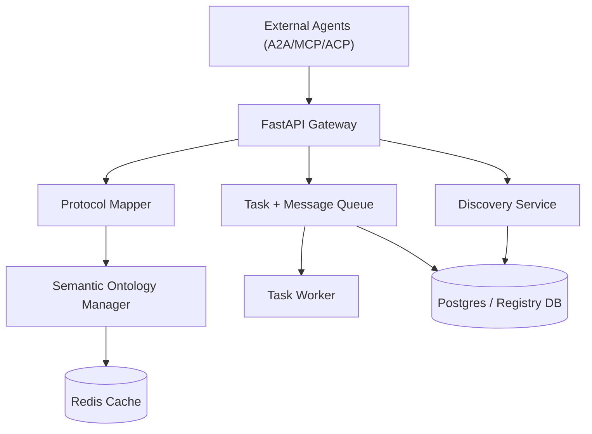

# Agent Translator Middleware

Neutral translation service that bridges A2A, MCP, and ACP protocols with semantic mapping, task orchestration, and agent discovery.

This README expands on the existing behavior without changing the core intent or flow of the project.

**Swagger UI**
Open `http://localhost:8000/docs` for the built-in FastAPI Swagger UI. The OpenAPI JSON is available at `http://localhost:8000/openapi.json`.

**Table of Contents**
1. Overview
2. Features
3. Architecture
4. Quick Start
5. Configuration
6. API Surface
7. Usage Examples
8. Observability
9. Development
10. Deployment
11. Troubleshooting
12. Related Docs

**Overview**
The middleware acts as a neutral bridge between agents that speak different protocols (A2A, MCP, ACP). It registers agents, discovers compatible collaborators, translates message envelopes, and resolves semantic differences in payloads so tasks can be safely handed off across protocol boundaries.

**Features**
- Protocol translation and envelope mapping across A2A, MCP, and ACP.
- Semantic resolution using ontologies and structured mapping rules.
- Registry and discovery of agents by protocol and semantic tags.
- Async task queue and agent message leasing for long-running workflows.
- ML-assisted mapping suggestions on failures (beta endpoint).
- Prometheus metrics at `/metrics` and structured logging.
- Global rate limiting (100 req/min/IP) with configurable HTTPS enforcement.

**Architecture**


**Quick Start**
```bash
python -m venv venv
venv\Scripts\activate
pip install -r requirements.txt
uvicorn app.main:app --reload
```

**Docker (optional)**
```bash
docker compose up --build
```

**Configuration**
All settings are loaded from environment variables (and `.env` when present). Defaults are shown below.

Core:
- `ENVIRONMENT` (default: `development`)
- `LOG_LEVEL` (default: `INFO`)
- `HTTPS_ONLY` (default: `false`)

Auth:
- `AUTH_ISSUER` (default: `https://auth.example.com/`)
- `AUTH_AUDIENCE` (default: `translator-middleware`)
- `AUTH_JWT_ALGORITHM` (default: `HS256`)
- `AUTH_JWT_SECRET` (required for HS* algorithms)
- `AUTH_JWT_PUBLIC_KEY` (required for RS*/ES* algorithms)

Database:
- `DATABASE_URL` (optional; when set, it is normalized to `postgresql+asyncpg://`)
- `POSTGRES_SERVER` (default: `db`)
- `POSTGRES_USER` (default: `admin`)
- `POSTGRES_PASSWORD` (default: `password`)
- `POSTGRES_DB` (default: `translator_db`)

Queue + leasing:
- `TASK_POLL_INTERVAL_SECONDS` (default: `2`)
- `TASK_LEASE_SECONDS` (default: `60`)
- `TASK_MAX_ATTEMPTS` (default: `5`)
- `AGENT_MESSAGE_LEASE_SECONDS` (default: `60`)
- `AGENT_MESSAGE_MAX_ATTEMPTS` (default: `5`)

Redis + semantic cache:
- `REDIS_ENABLED` (default: `true`)
- `REDIS_HOST` (default: `redis`)
- `REDIS_PORT` (default: `6379`)
- `REDIS_DB` (default: `0`)
- `REDIS_PASSWORD` (optional)
- `REDIS_URL` (optional, overrides host/port/db/password)
- `REDIS_CONNECT_TIMEOUT_SECONDS` (default: `0.2`)
- `REDIS_SOCKET_TIMEOUT_SECONDS` (default: `0.2`)
- `SEMANTIC_CACHE_TTL_SECONDS` (default: `600`)

ML mapping assistance:
- `ML_ENABLED` (default: `true`)
- `ML_MODEL_PATH` (default: `app/semantic/models/mapping_model.joblib`)
- `ML_MIN_TRAIN_SAMPLES` (default: `20`)
- `ML_AUTO_APPLY_THRESHOLD` (default: `0.85`)
- `MAPPING_FAILURE_MAX_FIELDS` (default: `50`)
- `MAPPING_FAILURE_PAYLOAD_MAX_KEYS` (default: `50`)

**Security Notes**
- JWT authentication is required for `/api/v1/translate` with scope `translate:a2a`.
- Beta translation requires scope `translate:beta`.
- Tokens must be issued by your auth service and validated via `AUTH_ISSUER` and `AUTH_AUDIENCE`.
- Rate limiting is enabled globally at 100 requests per minute per IP.
- In production, terminate TLS and enable HTTPS redirect (`HTTPS_ONLY=true`).

**Generate a Test JWT**
Use the helper script to mint a short-lived token for local or staging testing:
```bash
python scripts/generate_token.py --issuer https://auth.local/ --audience translator-middleware --subject test-user
```
Set `AUTH_JWT_SECRET` in your environment (or pass `--secret`) to match the API's configuration.

**API Surface**
Health + observability:
- `GET /` health check
- `GET /metrics` Prometheus metrics

Registry + discovery:
- `POST /api/v1/register` register an agent
- `GET /api/v1/discover` discover agents by protocol
- `POST /api/v1/discovery` discover agents by protocols and semantic tags
- `GET /api/v1/discovery/collaborators` ranked collaborator search by compatibility score

Translation:
- `POST /api/v1/translate` scoped translation endpoint
- `POST /api/v1/beta/translate` beta endpoint with failure logging + ML suggestions

Queue + leasing:
- `POST /api/v1/queue/enqueue` enqueue a translation task
- `POST /api/v1/agents/{agent_id}/messages/poll` lease next message for agent
- `POST /api/v1/agents/messages/{message_id}/ack` acknowledge a leased message

Ontology:
- `POST /api/v1/ontology/upload` upload RDF/XML ontology and load in memory

**Usage Examples (Integrating Agents)**
Register an agent in the registry:
```bash
curl -X POST http://localhost:8000/api/v1/register ^
  -H "Content-Type: application/json" ^
  -d "{\"agent_id\":\"agent-a\",\"endpoint_url\":\"http://agent-a:8080\",\"supported_protocols\":[\"a2a\"],\"semantic_tags\":[\"scheduling\"],\"is_active\":true}"
```

Translate a message between protocols:
```bash
curl -X POST http://localhost:8000/api/v1/translate ^
  -H "Authorization: Bearer <JWT>" ^
  -H "Content-Type: application/json" ^
  -d "{\"source_agent\":\"agent-a\",\"target_agent\":\"agent-b\",\"payload\":{\"intent\":\"schedule_meeting\",\"participants\":[\"alice@example.com\",\"bob@example.com\"],\"window\":{\"start\":\"2026-03-12T09:00:00Z\",\"end\":\"2026-03-12T11:00:00Z\"},\"timezone\":\"UTC\"}}"
```

Enqueue a task for asynchronous translation:
```bash
curl -X POST http://localhost:8000/api/v1/queue/enqueue ^
  -H "Content-Type: application/json" ^
  -d "{\"source_message\":{\"intent\":\"summarize\",\"content\":\"Summarize the attached report.\"},\"source_protocol\":\"a2a\",\"target_protocol\":\"mcp\",\"target_agent_id\":\"9b6c2c9b-7c8e-4f5b-9f3e-2a9cfa45c3b1\"}"
```

Agent polling and acknowledgement:
```bash
curl -X POST http://localhost:8000/api/v1/agents/9b6c2c9b-7c8e-4f5b-9f3e-2a9cfa45c3b1/messages/poll
curl -X POST http://localhost:8000/api/v1/agents/messages/<message_id>/ack
```

**Observability**
- Prometheus metrics are exposed at `GET /metrics`.
- Logs are structured (see `LOG_LEVEL`) and emitted at application startup, discovery cycles, and task worker lifecycle.

**Performance Notes**
- The database engine uses `asyncpg` via SQLAlchemy async engine for high-concurrency workloads.
- Semantic ontology lookups are cached in Redis to reduce repeated OWL searches.
- Profile the semantic mapper:
```bash
python -m app.semantic.profile_semantic_mapper --iterations 500
python -m app.semantic.profile_semantic_mapper --resolver --iterations 200
```

**Development**
Recommended local workflow:
```bash
python -m venv venv
venv\Scripts\activate
pip install -r requirements.txt
uvicorn app.main:app --reload
```

Run tests:
```bash
pytest -q
```

Project layout (high level):
- `app/` FastAPI app, services, semantic mapping, orchestration, DB models
- `scripts/` helper scripts (JWT generator, utilities)
- `monitoring/` dashboards and Kubernetes manifests
- `tests/` unit/integration tests
- `ARCHITECTURE.md` system design and component details
- `DEPLOYMENT.md` Render + Cloud Run deployment guides

**Deployment**
See `DEPLOYMENT.md` for Render (free tier) and Cloud Run instructions. The included `render.yaml` and `Dockerfile` are used for reproducible builds.

**Troubleshooting**
- `401` or `403` on `/api/v1/translate`: ensure JWT scope includes `translate:a2a` and issuer/audience match `AUTH_ISSUER` + `AUTH_AUDIENCE`.
- `Translation failed; mapping failures logged.`: check ML suggestions and mapping failure logs; consider updating ontologies or mappings.
- Redis connection errors: verify `REDIS_*` values or set `REDIS_ENABLED=false` for local testing.
- Postgres connection errors: verify `DATABASE_URL` or `POSTGRES_*` values. If your URL includes `sslmode=require`, it is normalized to `ssl=true` for asyncpg.

**Related Docs**
- `ARCHITECTURE.md`
- `DEPLOYMENT.md`
- `MISSION.md`
